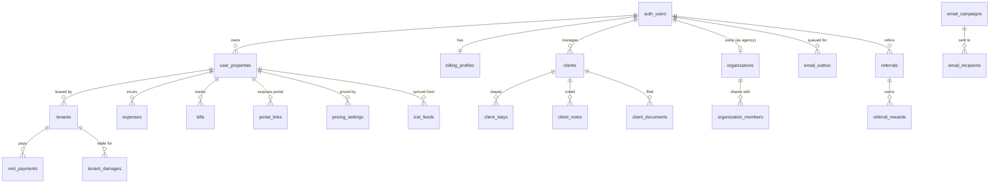

# Database & backend — schema reference

PropertyOS runs on **Supabase**: PostgreSQL with Row-Level Security, Auth, Storage,
and Deno Edge Functions, plus `pg_cron` + `pg_net` for scheduled work. The schema is
**≈70 tables** (all in `public`), each with RLS enabled, owned by Supabase
`auth.users`.

This document is the map. The authority is the SQL:

- **`migrations/`** — schema as code, one migration per change, applied by CI
  (`.github/workflows/supabase-deploy.yml`). This is the source of truth for change
  management.
- **`SETUP_ALL.sql`** — the same schema as a single **idempotent** script (safe to
  run any number of times). It is the one-shot bootstrap for a brand-new project via
  the SQL editor; every statement is `… if not exists` / `drop policy if exists`.
- **`functions/`** — edge functions (Deno) and the `_shared` domain modules they import.

> Reproducibility note: a fresh environment rebuilds **entirely from `migrations/`** —
> the history is squashed into a production-schema baseline (`00000000000000_baseline.sql`
> + storage/scheduling companions) and validated from scratch on the staging project on
> every feature-branch push. `SETUP_ALL.sql` is a legacy convenience snapshot and is **not**
> the source of truth (see `../docs/infra/acquisition-readiness.md`).

## Entity overview (ERD)

Core entities and their relationships. Most `property_id` columns are deliberate
*soft* links to `user_properties.id` (validated in RLS, not by a DB foreign key), a
consistent pattern across the operational tables.



## Domains

| Domain | Tables |
|---|---|
| **Identity & org** | `organizations`, `organization_members`, `app_admins` |
| **Billing & plans** | `billing_profiles`, `invoices`, `invoice_counters`, `user_feedback`, `feedback_campaign_winners`, `mobile_waitlist` |
| **Properties** | `user_properties` (core), `properties`, `property_data`, `property_settings`, `property_documents`, `checklist_items`, `contacts`, `report_branding`, `onboarding_progress` |
| **Tenants & leases** | `tenants` (full lease terms), `rent_payments`, `rent_config`, `tenant_damages`, `tenant_comm_log`, `maintenance_requests`, `maintenance_tasks` |
| **Portals (token-gated)** | `portal_links`, `checkin_links`, `guest_checkins`, `accountant_links` |
| **CRM** | `clients`, `client_stays`, `client_notes`, `client_documents` |
| **Calendar & pricing** | `calendar_events`, `calendar_feed_tokens`, `ical_feeds`, `pricing_settings` |
| **Bills & energy** | `bills`, `bills_history`, `bills_settings`, `bills_electricity`, `expenses`, `energy_tariffs` |
| **Accounting & tax** | `bank_transactions`, `book_closings`, `issued_documents` |
| **Loans & market data** | `loan_programs`, `bank_rates`, `market_rates`, `loans`, `rent_comparables`, view `active_loan_programs` |
| **Referrals** | `referral_codes`, `referrals`, `referral_rewards`, `referral_partners` |
| **Email & messaging** | `email_campaigns`, `email_recipients`, `email_outbox`, `email_marketing_prefs`, `product_updates`, `messaging_prefs`, `push_devices`, `notification_preferences`, `notification_log` |
| **Inventory** | `inventory_items`, `inventory_maintenance`, `inventory_handovers`, `inventory_repairs` |
| **System** | `cron_secrets`, `activity_log` |

## Row-Level Security

RLS is enabled on **every** table. Full model in
[`../docs/db/rls-conventions.md`](../docs/db/rls-conventions.md). In short:

- **Owner-keyed** (dominant) — `USING (user_id = auth.uid())` for all commands.
- **Owner-via-property** — child tables check ownership through `user_properties`.
- **Org-shared** — read/edit fanned out via `org_owner_ids()` / `org_editor_owner_ids()`
  for active organization members with `can_edit`.
- **Reference / public read** — `energy_tariffs`, `market_rates`, `bank_rates`,
  `loan_programs`, published `product_updates`.
- **Service / definer-managed** — `cron_secrets`, `invoice_counters`, `email_outbox`
  and org writes are mutated only through `SECURITY DEFINER` RPCs or cron.
- **Token-gated public RPC** — portal / check-in / accountant / verify flows expose no
  table rows to `anon`; access is only through definer functions that validate a
  token/PIN.

Storage buckets (`property-files`, `lease-documents`, `inventory-docs`,
`maintenance-photos`) are private and path-scoped to the owner; `inventory-photos` is
public.

## Scheduled jobs (`pg_cron` → `pg_net` → edge functions)

| Job | Schedule (UTC) | Action |
|---|---|---|
| `send-reminders-daily` | `0 6 * * *` | Lease / bill / payment reminders |
| `market-data-daily` | `0 8 * * *` | Refresh ECB/Euribor/BoG + energy tariffs |
| `bank-rates-monthly` | `30 6 1 * *` | Refresh mortgage rate sheet |
| `send-monthly-statements` | `30 7 1 * *` | Per-owner rent statement for prior month |
| `send-newsletter-weekly` | `0 8 * * 2` | Product newsletter |
| `send-market-digest-weekly` | `0 7 * * 1` | Market digest |
| `email-outbox-schedule` | `*/5 * * * *` | Stamp send windows per anti-spam policy |
| `email-outbox-drain` | `*/5 * * * *` | Drain queue → `send-lifecycle-email` |
| `feedback-draw-monthly` | `0 3 1 * *` | Draw feedback prize winner |

Cron authenticates to functions with a shared secret from `cron_secrets`
(`x-cron-secret`); `pg_net` only ever calls our own functions.

## Edge functions

| Function | Purpose |
|---|---|
| `send-lifecycle-email` | Renders a branded lifecycle email from shared templates → Resend (single source; drain target) |
| `schedule-email-outbox` | Cron pre-pass: stamps `send_window` on due outbox rows per policy |
| `dispatch-message` | One notification per event across email/push/Viber/WhatsApp/iMessage per the cadence plan |
| `send-client-email` | Owner→clients broadcast (batch ≤100), personalization, reply-to = owner |
| `send-newsletter` | Weekly product newsletter with GDPR unsubscribe link |
| `send-market-digest` | Weekly market/rate digest to opted-in users |
| `send-monthly-statements` | Monthly per-owner branded rent statement |
| `send-reminders` | Daily lease/bill/payment reminder emails (cron-only) |
| `send-org-invite` | Org membership invite (runs with caller JWT, RLS-checked) |
| `send-test-notification` | One real test notification from Settings |
| `notify-mobile-launch` | Emails the mobile waitlist at launch |
| `market-data-updater` | Daily macro-rate + tariff refresh |
| `bank-rates-updater` | Monthly mortgage-rate refresh |
| `ical-sync` | Server-side external iCal import (bypasses browser CORS) |
| `bookings-feed` | Exports a property's busy `.ics` for two-way sync |
| `smart-suggestions` | In-app smart suggestions |
| `_shared` | Shared email templates/copy, CORS, cadence policy (not deployable) |

## Applying changes

Never edit the database by hand. Write a migration under `migrations/`, push, and CI
applies it:

```bash
# CI does this automatically on push; locally, against a linked project:
supabase db push
supabase functions deploy <name> --no-verify-jwt
```

See [`../docs/db/security-and-automation.md`](../docs/db/security-and-automation.md).
